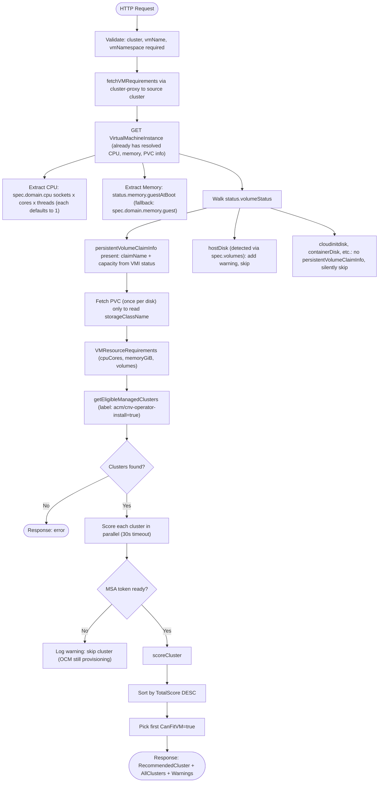
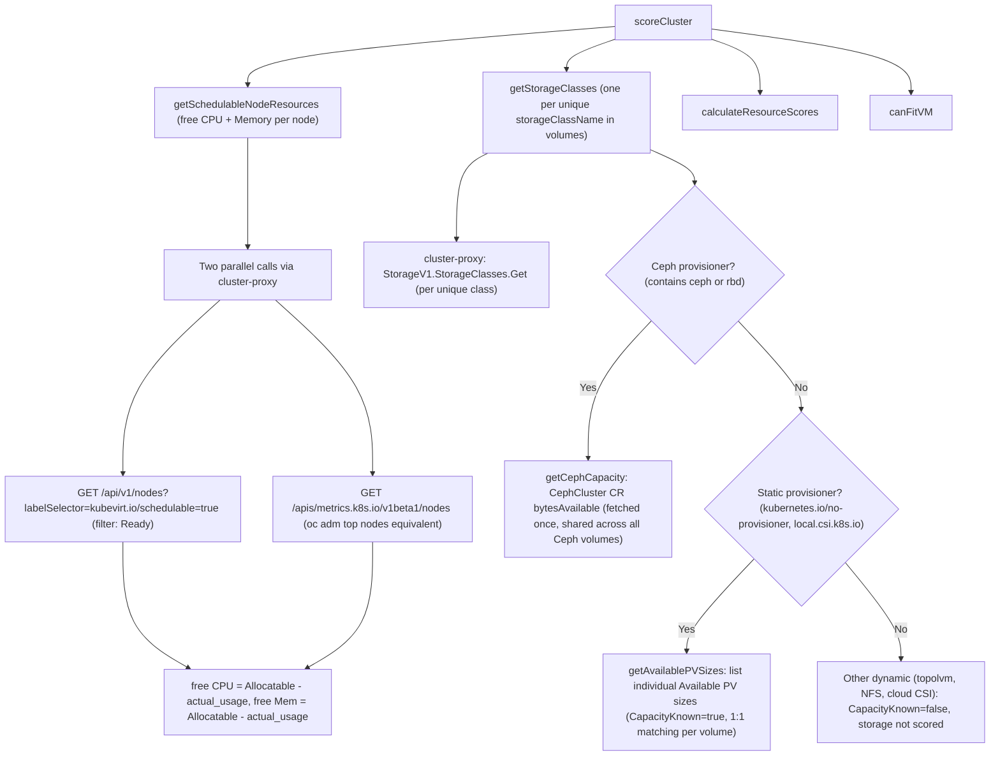
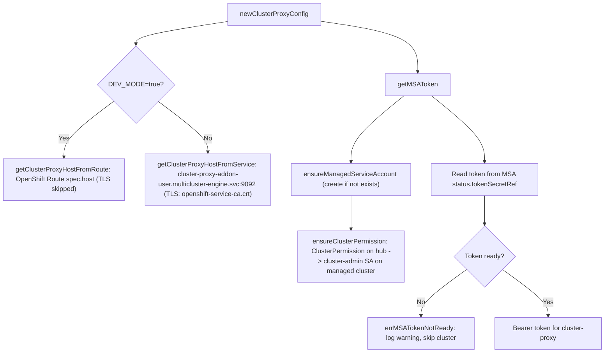
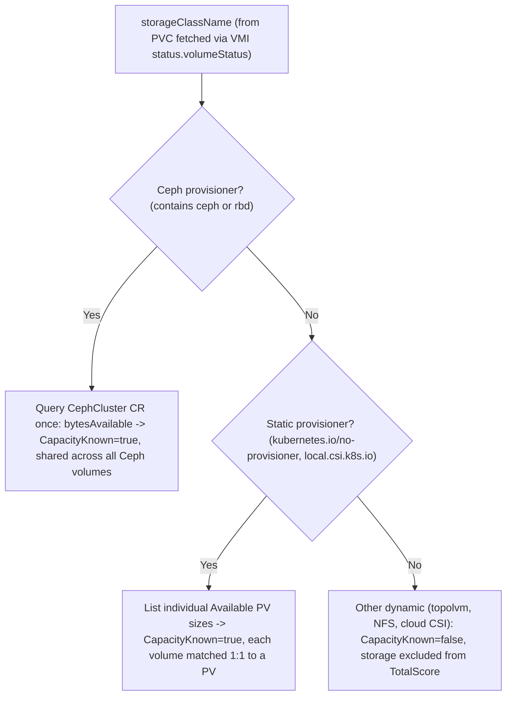

# Cluster Recommendation Flow

## API Entry Point

| Method | Path | Input |
|--------|------|-------|
| `GET`  | `/api/cluster-recommendation` | Query params: `cluster`, `vmName`, `vmNamespace` |
| `POST` | `/api/cluster-recommendation` | Same fields as JSON body |

**GET example:**
```
GET /api/cluster-recommendation?cluster=managed1&vmName=my-vm&vmNamespace=default
```

Storage class names and disk sizes are derived automatically from the running
`VirtualMachineInstance` status. The caller does not need to supply them.

---

## High-Level Flow



---

## VMI Volume Inspection

Storage info is read from `status.volumeStatus` in the `VirtualMachineInstance`.
Each entry that has a `persistentVolumeClaimInfo` block is a PVC-backed disk.
The VMI status already contains the actual `claimName` and `capacity` — no DataVolume fetch is needed.
The PVC is fetched once per disk only to read its `storageClassName`.

| `status.volumeStatus` entry | `persistentVolumeClaimInfo`? | Action |
|---|---|---|
| rootdisk, data disks (DataVolume or PVC backed) | Yes | Read `claimName` + `capacity.storage` from VMI; fetch PVC for `storageClassName` |
| `hostDisk` (detected from `spec.volumes`) | No | Cannot determine size → warning added to response |
| `cloudinitdisk`, `containerDisk`, `configMap`, `secret`, etc. | No | No persistent disk to migrate — silently skipped |

**Why VMI instead of VM?**

When a VM uses a `ClusterInstanceType` (e.g. `u1.medium`), the VM spec has `resources: {}`
with no CPU or memory values. The VMI has these already resolved by the time it is Running:

| Field | VM path | VMI path |
|---|---|---|
| CPU | `spec.template.spec.domain.cpu.{sockets,cores,threads}` (may be empty) | `spec.domain.cpu.{sockets,cores,threads}` (always set) |
| Memory | `spec.template.spec.domain.memory.guest` (may be empty) | `status.memory.guestAtBoot` → `spec.domain.memory.guest` |
| Disk sizes | Must fetch each DataVolume or PVC | `status.volumeStatus[*].persistentVolumeClaimInfo.capacity` |

---

## scoreCluster Detail



---

## cluster-proxy Authentication (per cluster, per request)



---

## Scoring Formula

```
Node selection:   best single node (max free CPU + free Memory)
                  VM lands on ONE node — total cluster sum is irrelevant

CPUScore          = freeNodeCPU  / requiredCPU      (ratio, no cap — higher = more headroom)
MemoryScore       = freeNodeMem  / requiredMemory   (ratio, no cap)

StorageScore      = totalAvailableGB / totalRequiredGB   for classes where CapacityKnown=true
                    (Ceph, static PVs — volumes grouped by class, totals compared)
                    excluded from TotalScore              for classes where CapacityKnown=false
                    (NFS, cloud CSI, topolvm — capacity not introspectable)

TotalScore        = (CPU + Memory + Storage) / 3    when any class has CapacityKnown=true
                  = (CPU + Memory) / 2              when all classes have CapacityKnown=false

CanFitVM          = any node has freeCPU >= required
                  AND any node has freeMem >= required
                  AND for each storageClass used by a volume:
                    Dynamic + CapacityKnown=false  -> always passes
                    Dynamic + CapacityKnown=true   -> sum(volumes using this class) <= available
                    Static  + CapacityKnown=true   -> each volume matched 1:1 to an Available PV
                                                      (PV size >= volume size, one PV per volume)
                    Class missing on target        -> fails
```

---

## Free Space Calculation

| Resource | Source | Formula |
|---|---|---|
| **CPU** | `GET /apis/metrics.k8s.io/v1beta1/nodes` | `node.Allocatable.CPU - metrics.usage.CPU` |
| **Memory** | `GET /apis/metrics.k8s.io/v1beta1/nodes` | `node.Allocatable.Memory - metrics.usage.Memory` |
| **Ceph storage** | `CephCluster CR status.ceph.capacity.bytesAvailable` | Direct (already free bytes) — fetched once per cluster |
| **Static PVs** | `GET /api/v1/persistentvolumes` field-filtered | Individual PV sizes listed — each volume matched 1:1 to a PV with size >= volume size |
| **topolvm / LVMS** | Not measurable (node VG) | VG free space not accessible via Kubernetes API |
| **NFS / cloud CSI** | Not measurable | Backend pool is virtually unlimited — no capacity check |

---

## Hub Resources Created Per Cluster (once, on first request)

| Resource | Kind | Namespace | Purpose |
|---|---|---|---|
| `cluster-recommendation` | `ManagedServiceAccount` | `<clusterName>` | Creates SA + rotated token on managed cluster |
| `cluster-recommendation` | `ClusterPermission` | `<clusterName>` | Binds SA to `cluster-admin` on managed cluster |

---

## Storage Class Behaviour by Provisioner

| Provisioner | `IsDynamic` | `CapacityKnown` | Eligibility check | Storage score | TotalScore |
|---|---|---|---|---|---|
| `openshift-storage.rbd.csi.ceph.com` (ODF/Ceph) | true | true | `sum(volumes) <= available` | `available / sum(volumes)` | `(CPU + Mem + Storage) / 3` |
| `rook-ceph.rbd.csi.ceph.com` (Rook) | true | true | `sum(volumes) <= available` | `available / sum(volumes)` | `(CPU + Mem + Storage) / 3` |
| `kubernetes.io/no-provisioner` (local static PVs) | false | true | each volume matched 1:1 to an Available PV (PV size >= volume size) | `totalAvailablePVs / sum(volumes)` | `(CPU + Mem + Storage) / 3` |
| `local.csi.k8s.io` (sig-storage local static CSI) | false | true | each volume matched 1:1 to an Available PV (PV size >= volume size) | `totalAvailablePVs / sum(volumes)` | `(CPU + Mem + Storage) / 3` |
| `topolvm.io` / `lvm.topolvm.io` (LVMS) | true | false | always passes | not scored | `(CPU + Mem) / 2` |
| `nfs.csi.k8s.io` (NFS CSI) | true | false | always passes | not scored | `(CPU + Mem) / 2` |
| `ebs.csi.aws.com` / `disk.csi.azure.com` / `pd.csi.storage.gke.io` | true | false | always passes | not scored | `(CPU + Mem) / 2` |
| `csi.vsphere.vmware.com` | true | false | always passes | not scored | `(CPU + Mem) / 2` |
| `driver.longhorn.io` | true | false | always passes | not scored | `(CPU + Mem) / 2` |
| Unknown + contains `csi` | true | false | always passes | not scored | `(CPU + Mem) / 2` |
| Unknown + no `csi` in name | false | true (0 GB if no PVs) | each volume matched 1:1 to an Available PV | `totalAvailablePVs / sum(volumes)` | `(CPU + Mem + Storage) / 3` |
| **Missing on target cluster** | — | — | **fails immediately** | — | — |

---

## Storage Class Decision Tree


